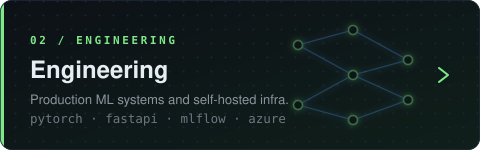

<!--
  ═══════════════════════════════════════════════════════════════════
  PROFILE README — Geoffrey313/Geoffrey313 (public)
  Generic profile: no employer / institution names.
  ═══════════════════════════════════════════════════════════════════
-->

  

  

  
  
  

## About

Quantitative researcher and AI architect. I hold a PhD in statistical finance and a postdoc in
finance from Tsinghua University (School of Economics and Management). My research sits at the
intersection of **complex systems** and **financial markets** — market microstructure and optimal
execution, empirical asset pricing, macro-finance, portfolio allocation, and structural / causal
work across markets. In parallel I pursue applied machine-learning research: **computer vision**,
**graph neural networks**, and **anomaly / fraud detection**.

On the engineering side I work end-to-end as a **Lead R&D & AI Architect**: AI research,
algorithmic modelling, system and infrastructure design, automation, and production deployment
across cloud and on-premise — including the full MLOps lifecycle. I have delivered systems for
**hedge funds, investment banks, insurance companies and fintech firms**.

- 🔬 Research across complex systems, market microstructure, empirical asset pricing and macro-finance.
- 🧠 Applied ML: computer vision, graph neural networks, anomaly & fraud detection.
- 🛠️ End-to-end delivery: modelling → system design → automation → production (cloud & on-prem), with MLOps.
- 🌏 Based between Paris and Tianjin.
- 🤝 Open to research collaboration on microstructure and empirical asset pricing — and on complex-systems and macro-financial approaches to asset allocation and portfolio optimisation.
- ✉️ Reach me via LinkedIn or email.

## Explore

  
  

  
  

## Toolbox

  

**Research & modelling**

**Services & data**

**Infrastructure & security**

## Selected work

Current working papers (2026):

<table>
<tr>
<td width="50%" valign="top">

**Bonds or Gold: The Price of Monetary Trust**
Safe-haven demand and the price of monetary trust.
`working paper · 2026`

</td>
<td width="50%" valign="top">

**One Growth May Hide Another**
Financing source, asset growth and stock returns across twenty-four markets.
`working paper · 2026`

</td>
</tr>
<tr>
<td width="50%" valign="top">

**The Policy Supply of Low Volatility**
Volatility suppression and release in foreign-exchange and sovereign-bond markets.
`working paper · 2026`

</td>
<td width="50%" valign="top">

**No News before the News**
Information flow and price behaviour ahead of announcements.
`working paper · 2026`

</td>
</tr>
<tr>
<td width="50%" valign="top">

**From Microprice to Microdiffusion**
Heavy-tailed price diffusion in limit-order books.
`working paper · 2026`

</td>
<td width="50%" valign="top">

**The fragility ratio Λ**
When order-book imbalance fails as a signal.
`working paper · 2026`

</td>
</tr>
<tr>
<td width="50%" valign="top">

**Migrating Blind**
How China's Gaokao reform stopped family arbitrage.
`working paper · 2026`

</td>
<td width="50%" valign="top">

**Below the Line**
Detecting accounting anomalies in Shariah-compliant equities.
`working paper · 2026`

</td>
</tr>
</table>

<!--
  ── OPTIONAL BLOCK ─────────────────────────────────────────────────
  Public contribution widgets. Delete this whole section if most of
  your work lives in private repos.
-->

## Activity

  

  

  

<!-- ── END OPTIONAL BLOCK ──────────────────────────────────────────── -->
