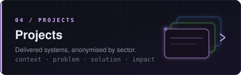

  

<a href="../README.md">← back to profile</a>

# Projects

Selected work, grouped by sector. Client names are withheld. Each project carries a status tag
(`live` / `pilot` / `in progress`) and a deployment tag
(
),
and is described as Problem, Solution, Architecture and Contribution.

## Securities

### Market-making platform
 

Automated market making / designated liquidity provision on an emerging equity exchange.

- **Problem:** meet exchange liquidity-provider obligations (max spread, minimum size, presence time) throughout the session without accumulating unhedgeable inventory, at low latency.
- **Solution:** a GLFT / Stoikov microprice quoting engine (tick-volatility and liquidity estimators, inventory skew, intraday regime schedules, end-of-day flattening); Bayesian walk-forward calibration with Optuna, tracked in MLflow.
- **Architecture:** a React / TypeScript operator dashboard over a FastAPI backend, with a Redis pub/sub control plane coordinating one CPU-pinned engine per symbol and an exchange-gateway connector over STOMP/TLS; a separate JWT auth API behind Nginx / Cloudflare. High availability via Redis Sentinel and Pacemaker-based engine failover (in progress). Deployed on-premise via an offline installer (Docker for app and backing stores, systemd for engines and bridges).
- **Contribution:** built the full stack, from the calibration research system (backtester, walk-forward, experiment tracking) to the production operator platform.

`Python · FastAPI · Optuna · MLflow · Redis · PostgreSQL · MinIO · Vault · React · Docker`

## Asset Management

### Portfolio intelligence & agentic-AI assistant
 

Decision-support platform for discretionary equity portfolio managers moving off spreadsheets.

- **Problem:** no centralised monitoring, quantitative risk analytics or alerting; a manual, reactive workflow.
- **Solution:** a quantitative risk engine (VaR / CVaR by historical, parametric and Monte-Carlo methods, drawdown, correlation, efficient frontier, attribution, stress) and an enhanced-indexing optimiser (SLSQP under tracking-error and sector / cardinality constraints), paired with an agentic-AI assistant that emits typed artifacts (trade tickets, daily pulse, risk reports, macro memos) with real-time web context.
- **Architecture:** a React SPA acting as a pure renderer over a FastAPI backend that owns all data, computation, configuration and the AI proxy; a flat-file store in the proof-of-concept, with PostgreSQL + Redis as the production target.
- **Contribution:** delivered a demo-ready platform: firm-wide and per-portfolio dashboards, a configurable alert engine, the full risk suite, benchmark-relative performance, and an agentic analysis hub with persisted theses and per-client restructuring assessments.

`Python · FastAPI · SciPy · pandas · agentic LLM · React · TypeScript · Recharts · Docker`

## Investment Banking

### Treasury middle-office automation
 

On-premise RAG assistant for a bank's treasury / middle-office risk function.

- **Problem:** portfolio-risk surveys and reporting to the risk department were manual and slow, under strict data-privacy constraints.
- **Solution:** a multi-layered RAG assistant automating portfolio-risk surveys and report generation on real-time data, with fully on-premise LLM serving and no data egress.
- **Architecture:** API integration into the bank's existing systems; all inference and retrieval run on-premise to keep data privacy intact.
- **Contribution:** delivered the on-premise RAG pipeline and end-to-end reporting automation for the middle office.

`Python · on-prem LLMs · RAG · FastAPI · API integration`

### Shariah-compliance screening
 

Screening and monitoring of publicly listed equities for equity research.

- **Problem:** standard screening reduces to a few static balance-sheet ratios and ignores whether the financials are trustworthy or whether firm conduct is drifting.
- **Solution:** fuses a quantitative accounting-anomaly track (Benford, Zipf, a reduced M-score, threshold-proximity, cross-statement coherence, peer-group Hotelling T-squared) with statistical calibration and false-discovery control, and a qualitative LLM / NLP track (zero-shot NLI plus multilingual sentiment over filings, news and social feeds) into a composite compliance-intelligence score.
- **Architecture:** a FastAPI backend with a React / TypeScript dashboard (plus a Streamlit analytics client) over PostgreSQL and object storage, with Prefect orchestrating the ingestion and scoring pipelines and JWT auth.
- **Contribution:** built the end-to-end platform, from ingestion and panel-build to the detector library, the NLP cascade, backend, dashboard and an accompanying research paper.

`Python · scikit-learn · Transformers · litellm · FastAPI · PostgreSQL · MinIO · Prefect · React`

### Agentic investment-advisory platform
 

Platform for a Sharia-compliant investment, advisory and research firm (portfolio management, buy-side M&A, compliance).

- **Problem:** core workflows are manual and slow, due diligence spans months, Shariah screening is a periodic bolt-on, and portfolio managers lack real-time monitoring, risk alerting and automated reporting across fragmented data.
- **Solution:** an agentic-AI and quant platform in three pillars: an investment copilot of LLM / SLM agents (real-time flagging, automated briefs, VaR / drawdown / stress, rebalancing); a deterministic AI due-diligence pipeline (RAG plus OCR and NLP, forensic / Benford analytics, DCF, multiples and Monte-Carlo valuation, human-in-the-loop Go / No-Go synthesis); and a Shariah-compliance engine (daily screening, AAOIFI rating, manipulation detection).
- **Architecture:** a RAG dashboard over ETL, backtesting and paper-trading pipelines with multi-portfolio orchestration; cloud deployment.
- **Contribution:** delivered the solution architecture and phased delivery plan (proof-of-concept then production rollout).

`Agentic RAG · LLM / SLM · OCR · NLP · MLflow · Monte Carlo · HRP · forensic analytics`

## Insurance

### Drought-damage claims assessment
  

Regulated drought-subsidence building-damage claims, computer vision plus vision-LLM.

- **Problem:** experts manually inspect large seasonal volumes of field photographs (~150k per season) and hand-fill a standardised damage schedule, which is slow and subjective.
- **Solution:** a CV + vision-LLM pipeline (text-prompted SAM3 segmentation, then a vision LLM grounded on reference cases and the regulated methodology) drafts the standardised assessment, returned for expert validation; the AI-draft versus expert-final archive feeds continuous model improvement.
- **Architecture:** an asynchronous FastAPI machine-to-machine service (job lifecycle, callback with retry) with an operator SPA dashboard (FR / EN i18n); a single Docker image switches between on-premise (Vault, MinIO, MLflow) and Azure (Key Vault, Blob Storage, Container Apps on a T4 GPU) via one environment variable.
- **Contribution:** delivered the end-to-end backend, the integration API, a versioned output-assembly engine, the operator dashboard, and full Azure deployment automation.

`Python · SAM3 · PyTorch · Azure OpenAI · FastAPI · MLflow · Vault · MinIO · Azure Container Apps`

### Motor-claims automation & fraud detection
 

Motor (and broader) claims automation for a Takaful insurer.

- **Problem:** manual, fragmented claims handling caused slow turnaround, inconsistent decisions, fraud leakage and high operational cost.
- **Solution:** a human-in-the-loop AI claims platform with omnichannel intake, computer vision that detects, segments and scores vehicle damage and reconciles it against the repair parts list, image-and-metadata fraud flags (staged accidents, pre-existing damage, duplicates), and an LLM that drafts a standardised assessment report.
- **Architecture:** omnichannel intake into a shared data lake feeding pluggable engines, behind an expert-review and governance gate; async job orchestration, machine-to-machine auth, a managed secrets vault, role-based access and full audit / archive; Azure reference deployment with data-residency options.
- **Contribution:** delivered the solution architecture and phased roadmap (motor first, then credit-life document AI, then medical anomaly detection), reusing components from a prior production insurance computer-vision deployment.

`Computer vision · LLM report generation · OCR · anomaly detection · Azure · RBAC / audit`

## Fintech

### Transaction-fraud detection
 

Fraud detection for an online payments / transaction-processing operator.

- **Problem:** detect fraudulent or anomalous transactions in real time across a large, evolving transaction network, without relying on scarce labelled fraud examples.
- **Solution:** a graph neural network over the transaction graph performing label-free anomalous sub-graph detection, flagging structural outliers (synchronised timing, implausible account-age distributions, over-clustered patterns, near-duplicate bursts) into a risk-scoring pipeline.
- **Architecture:** a GNN scoring service over the transaction graph feeding a real-time flagging pipeline, on GPU compute.
- **Contribution:** delivered a GNN-based fraud-scoring capability on the live transaction graph; the architecture proved transferable and was later reused for coordinated-campaign detection.

`PyTorch Geometric · GPU · unsupervised graph anomaly detection`

## B2B Trade & Procurement

### Sourcing & tender-intelligence platform
 

Procurement-intelligence platform for an international B2B sourcing / import-export intermediary, with customs HS-code-driven supplier matching and tender monitoring.

- **Problem:** tender-watch and supplier data are scattered across internal spreadsheets and dozens of external portals; monitoring is manual, data is re-keyed by hand, opportunities are found late, and there is no single source of truth for scoring offers against specs, norms and price.
- **Solution:** a deterministic-first decision layer where RPA enriches specs against norms and certifications, weighted rules and an ML model score supplier offers, AI control agents flag mismatches (they never decide), and a RAG chatbot answers natural-language queries; a human arbitrates.
- **Architecture:** a five-layer, fully managed, GPU-free cloud design: per-source connectors with scheduled and event-driven ingestion normalise data and attach HS codes into a PostgreSQL source of truth plus object storage and a vector index; a unified UI (analytics dashboard, pipeline tracker, alert center, embedded chatbot).
- **Contribution:** delivered the target architecture, five-layer design, fixed-price delivery plan and operating-cost model, positioned as a decision-support platform where AI assists and humans retain control.

`PostgreSQL · vector search · RPA · classical ML scoring · agentic AI · RAG · managed cloud`

## Government / Strategic Communications

### Narrative-monitoring platform
  

National-scale information-integrity and narrative monitoring for a public institution, multilingual.

- **Problem:** detect hostile narratives and false claims early across social, news and messaging channels, predict virality before critical mass, and respond at the highest-leverage points, under strict evidence and policy governance.
- **Solution:** a three-stage funnel: cheap multilingual ingestion with velocity / burst detection, a claim-triage classifier, then two deep streams on accelerating narratives only, a graph neural network forecasting forward propagation and ranking intervention nodes, and a RAG plus constrained-LLM verification engine producing cited verdicts; a deterministic policy engine fuses spread, probability-of-false and severity into tiered responses.
- **Architecture:** a modular streaming platform (Kafka ingestion, a Neo4j graph, a vector store, containerised services on Kubernetes with Prometheus / Grafana / Loki observability), deployable to cloud or fully on-premise / air-gapped.
- **Contribution:** delivered the end-to-end architecture, phased build plan, data and cold-start strategy, and a dual cloud / on-premise deployment design with a costed total-cost-of-ownership.

`Python · PyTorch Geometric · multilingual transformers · vLLM / Azure OpenAI · Neo4j · Kafka · Qdrant · Kubernetes`
